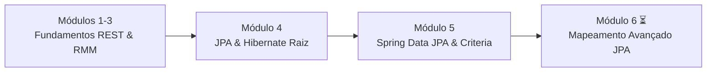

# 🥑 AlgaFood API — Backend Delivery


> **API RESTful profissional para um sistema de delivery de comida**, desenvolvida com foco em Engenharia de Software Backend, Arquitetura Limpa, Mapeamento Relacional e Padrões de Projeto.

---

## 📌 Sobre o Projeto & Contexto de Estudo

Este repositório contém a implementação da **AlgaFood API**, construída durante o curso **Especialista Spring REST (AlgaWorks)**. 

O objetivo principal deste projeto é consolidar a transição profissional para a **Engenharia de Software Backend em Java**, evoluindo progressivamente desde a base até a arquitetura corporativa avançada.

- **Autor:** Joabe ([joabdevelop](https://github.com/joabdevelop))
- **Status do Projeto:** 🟡 **Em Andamento** (Módulos 1 a 5 concluídos; Módulo 6 iniciado).

---

## 🗺️ Progresso dos Módulos & Conhecimentos Adquiridos



### ✅ Módulos Concluídos (1 ao 5)

#### 🔹 Módulos 1 a 3: Fundamentos de APIs RESTful & Boas Práticas
- Conceitos de arquitetura REST, Recursos, URIs e representações em JSON.
- Uso adequado dos Verbos HTTP (`GET`, `POST`, `PUT`, `DELETE`, `PATCH`).
- Aplicação correta dos Códigos de Status HTTP (`200 OK`, `201 Created`, `204 No Content`, `400 Bad Request`, `404 Not Found`, `409 Conflict`, `500 Server Error`).
- Aplicação do **Modelo de Maturidade de Richardson (RMM)** nos Níveis 0 a 3.

#### 🔹 Módulo 4: Mapeamento de Entidades com JPA e Hibernate (Nível Fundamento)
- Mapeamento O/R básico com anotações JPA (`@Entity`, `@Table`, `@Id`, `@GeneratedValue`, `@Column`).
- Mapeamento de relacionamentos N:1 (`@ManyToOne`, `@JoinColumn`).
- Persistência e manipulação direta de entidades via `EntityManager`.
- Implementação de atualização parcial com o verbo `PATCH` utilizando **Java Reflection** e **Jackson `ObjectMapper`**.

#### 🔹 Módulo 5: Produtividade e Consultas Avançadas com Spring Data JPA (Destaque)
- **Interfaces com `JpaRepository<T, ID>`:** Herança de operações de CRUD e eliminação de código repetitivo de infraestrutura.
- **Query Methods Automáticos:** Criação de consultas por convenção de nomenclatura (`findByNomeContaining`, `countByCozinhaId`, `existsByNome`, `findFirstBy`).
- **Consultas JPQL Customizadas:** Uso de `@Query` e externalização de consultas complexas no arquivo XML `META-INF/orm.xml` para desacoplamento de código.
- **Consultas Dinâmicas com Criteria API:** Construção programática e *type-safe* de cláusulas `WHERE` utilizando `CriteriaBuilder`, `Root` e `ArrayList<Predicate>` para filtros opcionais de URL.
- **Padrão Specifications (Domain-Driven Design - DDD):** Encapsulamento de regras de negócio reutilizáveis e componíveis (`RestauranteSpecs.comFreteGratis()`, `.and()`, `.or()`).
- **Customização do Repositório Base:** Criação de `CustomJpaRepositoryImpl` configurado globalmente em `@EnableJpaRepositories` para prover métodos utilitários a todas as entidades.
- **Tratamento de Dependência Circular:** Uso de `@Lazy` na injeção de dependências do Spring para resolução de ciclos entre repositórios customizados.
- **Segurança de Nulos com `Optional<T>`:** Manipulação de retornos seguros com `.orElseThrow()` na camada de serviço e `.orElse(null)` nos controllers.

---

### ⏳ Módulo Atual em Andamento

- **Módulo 6:** *Mapeamento de entidades avançado com JPA e Hibernate* (Relacionamentos 1:N, N:N, Eager/Lazy loading, Cascade, Embeddable).

---

## 🛠️ Tecnologias & Ferramentas Utilizadas

- **Linguagem:** Java 25 (Oracle OpenJDK)
- **Framework:** Spring Boot 2.7.18
- **Persistência / ORM:** Spring Data JPA / Hibernate 5.6
- **Banco de Dados:** MySQL 8.0
- **Build & Dependências:** Apache Maven
- **Testes de API:** Postman / Bruno / cURL
- **Versionamento:** Git & GitHub CLI

---

## 🏛️ Arquitetura da Aplicação

A API segue uma arquitetura em camadas bem definida:

```
src/main/java/com/algaworks/algafood/
 ├── api/
 │    └── controller/        # Controladores REST HTTP (Rotas e DTOs)
 ├── domain/
 │    ├── model/             # Entidades de Negócio (@Entity)
 │    ├── repository/        # Interfaces Spring Data JPA & Specifications
 │    ├── service/           # Regras de Negócio e Validações
 │    └── exception/         # Exceções de Domínio Personalizadas
 └── infrastructure/
      └── repository/        # Implementações Customizadas (Criteria API & Spec)
```

---

## 🚀 Como Executar o Projeto Localmente

### Pré-requisitos
- JDK 17 ou superior (Java 25 suportado)
- MySQL 8.0 rodando na porta `3306` (usuário `root`, sem senha por padrão em dev)
- Maven 3.x (ou o `mvnw` embutido)

### Passos
1. **Clonar o repositório:**
   ```bash
   git clone https://github.com/joabdevelop/algafood-api.git
   cd algafood-api
   ```

2. **Compilar o projeto:**
   ```bash
   .\mvnw clean test-compile
   ```

3. **Executar a aplicação Spring Boot:**
   ```bash
   .\mvnw spring-boot:run
   ```

4. **Acessar os endpoints da API:**
   A aplicação subirá na porta `8080`. Exemplo de rotas disponíveis:
   - `GET http://localhost:8080/restaurantes`
   - `GET http://localhost:8080/cozinhas`
   - `GET http://localhost:8080/cidades`
   - `GET http://localhost:8080/estados`
   - `GET http://localhost:8080/teste/resturantes/com-frete-gratis?nome=Thai`

---

## ✉️ Contato

Desenvolvido por **Joabe**  
- **GitHub:** [@joabdevelop](https://github.com/joabdevelop)  
- **Foco Profissional:** Engenharia de Software Backend Java & Arquitetura de Sistemas
